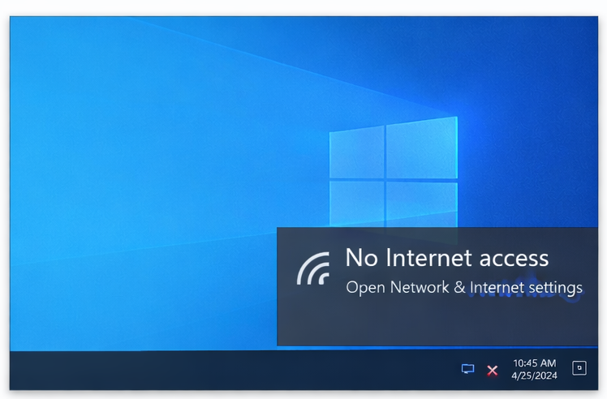
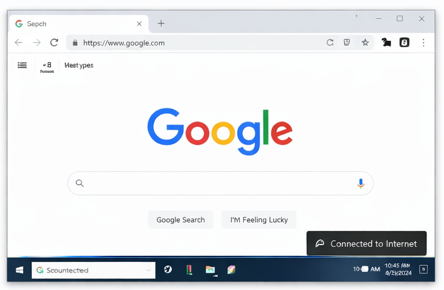

# Internet Connectivity Issue – IT Support Ticket

## Issue
User reported that their PC could not connect to the internet.

## Environment
- Operating System: Windows 10
- Network: Wi-Fi / Ethernet

## Troubleshooting Steps
1. Checked physical connections and Wi-Fi network.
2. Verified IP settings and DNS configuration.
3. Restarted router and PC.
4. Used `ping` command to test connectivity.
5. Updated network adapter drivers.

## Root Cause
Incorrect IP configuration / temporary network outage.

## Resolution
Network settings corrected and internet access restored.

## Screenshots
### Internet Not Working

### Internet Working

## Status
Resolved